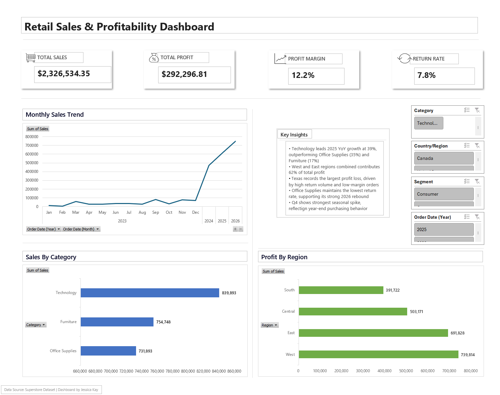

# 📈 Retail Analytics Dashboard  
### Built with:  
🟦 Excel & Power Query | 📊 PivotTables & PivotCharts | 📁 Data Cleaning | 📉 Trend Analysis

  

This project delivers an interactive Excel dashboard analyzing multi‑year retail performance across Sales, Profit, Category trends, Regional contribution, and Return behavior. The dashboard is designed for fast executive‑level insight, with clean visual structure, consistent formatting, and a dedicated Key Insights panel summarizing the most important findings.

Key Features
- Multi‑year analysis of Sales and Profit (2023–2026)

- Category performance trends with YoY growth calculations

- Regional profit contribution and loss identification

- Return rate analysis by product category

- Seasonal trend detection across quarters

- Fully interactive slicer panel for dynamic filtering

- Clean, modern layout with structured three‑column design

- Analytical Key Insights box summarizing top findings

Analytical Insights
- Technology leads 2025 YoY growth at 39%, outperforming Office Supplies (35%) and Furniture (17%)

- West and East regions together contribute 62% of total profit

- Texas records the largest profit loss, driven by high return volume

- Office Supplies maintains the lowest return rate, supporting its 2026 rebound

- Q4 shows the strongest seasonal spike, reflecting year‑end purchasing behavior

Tools & Skills Demonstrated
- Excel (Power Query, PivotTables, PivotCharts, Slicers)

- Data cleaning and transformation

- KPI design and dashboard layout

- Analytical storytelling and insight extraction

- Professional formatting and UI/UX principles for BI dashboards
